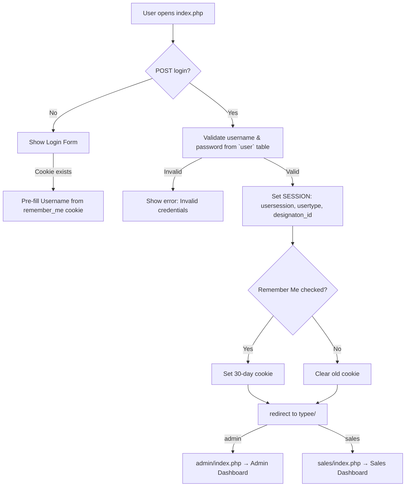
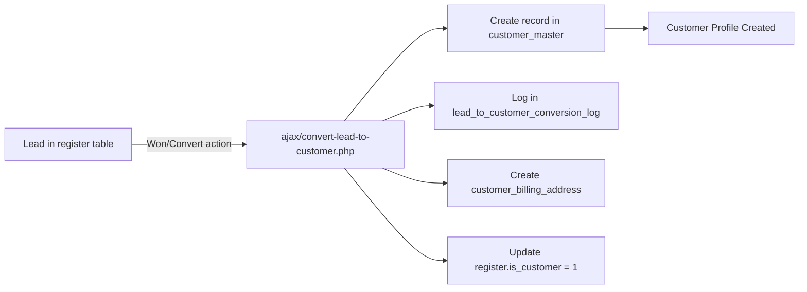
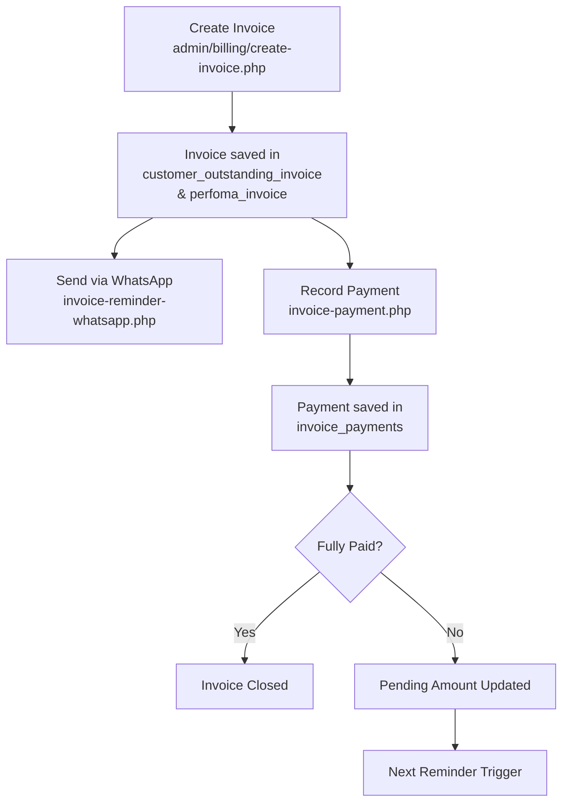
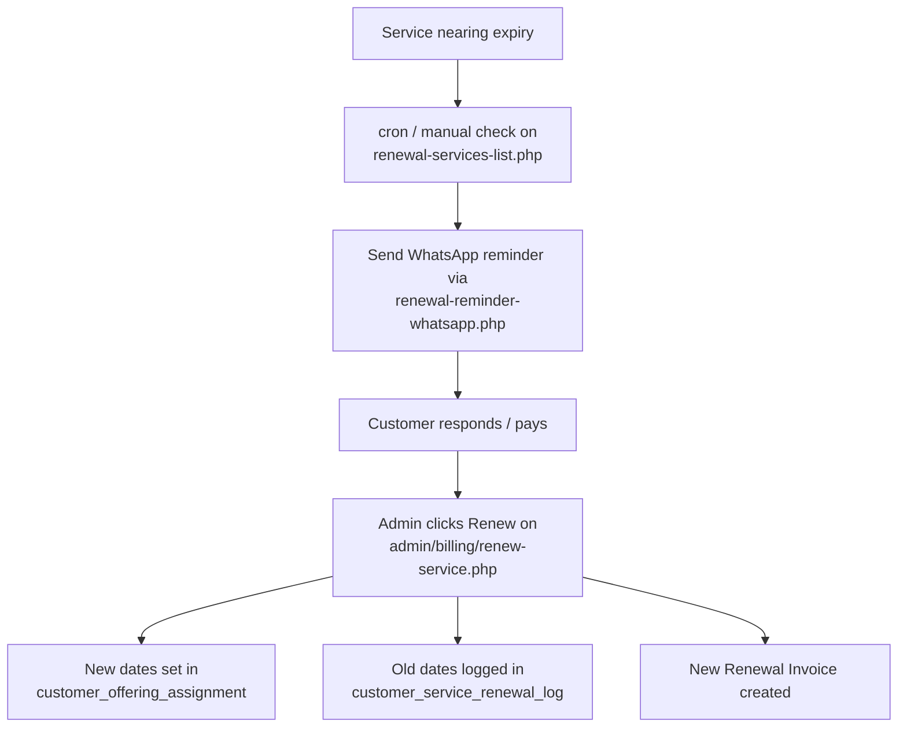
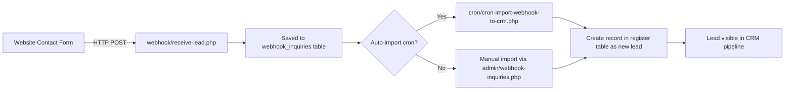
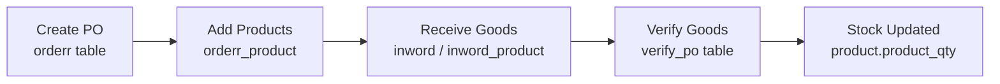
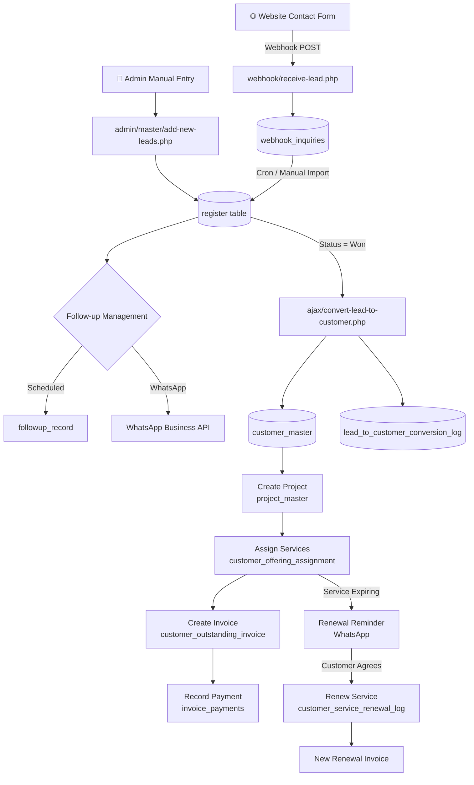
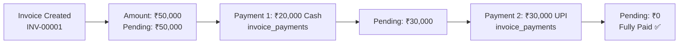

# 📋   CRM — Complete Project Overview

> **Project Name:**  CRM New  
> **Database:** `crm_new`  
> **Tech Stack:** PHP 7.4, MariaDB 10.4, Bootstrap 5, jQuery, Firebase FCM, WhatsApp Business API  
> **Server Environment:** Apache / XAMPP (Windows)  
> **Developed By:**  Web Developer Team  

---

## 📌 Table of Contents

1. [Project Purpose & Summary](#1-project-purpose--summary)
2. [Technology Stack](#2-technology-stack)
3. [Directory Structure](#3-directory-structure)
4. [User Roles & Access Control](#4-user-roles--access-control)
5. [System Login Flow](#5-system-login-flow)
6. [Module 1 — Lead Management](#6-module-1--lead-management)
7. [Module 2 — Customer Management](#7-module-2--customer-management)
8. [Module 3 — Follow-up Management](#8-module-3--follow-up-management)
9. [Module 4 — Task Management](#9-module-4--task-management)
10. [Module 5 — Project Management](#10-module-5--project-management)
11. [Module 6 — Billing & Invoicing](#11-module-6--billing--invoicing)
12. [Module 7 — Service & Renewal Management](#12-module-7--service--renewal-management)
13. [Module 8 — WhatsApp Integration](#13-module-8--whatsapp-integration)
14. [Module 9 — Webhook Integration](#14-module-9--webhook-integration)
15. [Module 10 — Notifications (FCM)](#15-module-10--notifications-fcm)
16. [Module 11 — Reports & Analytics](#16-module-11--reports--analytics)
17. [Module 12 — Master Data Management](#17-module-12--master-data-management)
18. [Module 13 — Product & Inventory](#18-module-13--product--inventory)
19. [Module 14 — Purchase & Procurement](#19-module-14--purchase--procurement)
20. [Complete Database Schema](#20-complete-database-schema)
21. [Key System Flows (Diagrams)](#21-key-system-flows-diagrams)
22. [AJAX Endpoints](#22-ajax-endpoints)
23. [Cron Jobs](#23-cron-jobs)
24. [Important Files Reference](#24-important-files-reference)

---

## 1. Project Purpose & Summary

** CRM New** is a comprehensive, web-based Customer Relationship Management system built specifically for a web development and IT services company ( Web Developer / Raghav Solar). It manages the full lifecycle of business relationships — from the moment a prospect inquiry lands on the website, through lead nurturing, deal closure, customer onboarding, project delivery, invoicing, and recurring service renewals.

### Key Business Capabilities

| Area | What It Does |
|------|-------------|
| **Lead Pipeline** | Capture leads from websites via webhook, manage follow-ups, track deal stages |
| **Customer 360°** | Full customer profiles, notes, tags, billing addresses, service history |
| **Invoicing** | GST-compliant invoices, payment tracking, credit notes, renewal invoices |
| **Project Tracking** | Assign services/offerings to projects, track milestones and delivery status |
| **Renewals** | Detect expiring services, send WhatsApp reminders, log renewal history |
| **WhatsApp Messaging** | Send template or free-text messages to leads/customers via WhatsApp Business API |
| **Task Management** | Assign tasks to leads or customers, track priority, due dates, and activity |
| **Reports** | Lead reports, follow-up reports, data reports by source, status and salesperson |

---

## 2. Technology Stack

| Layer | Technology |
|-------|-----------|
| **Backend Language** | PHP 7.4 |
| **Database** | MariaDB 10.4 (MySQL compatible) |
| **Frontend** | Bootstrap 5, jQuery, DataTables, Select2, Flatpickr |
| **Session Auth** | PHP native sessions (`$_SESSION`) |
| **Push Notifications** | Firebase Cloud Messaging (FCM) — Web Push |
| **WhatsApp API** | Meta WhatsApp Business Cloud API |
| **Cron Jobs** | PHP CLI scripts for automated lead import |
| **Webhook Receiver** | PHP endpoint (`webhook/receive-lead.php`) |
| **File Uploads** | PHP native file handling to `uploads/` directory |
| **PDF Generation** | Browser print (invoice-print.php renders HTML for PDF) |
| **Email / SMS** | Stub module (`sms_send_module.php`) — not fully active |

---

## 3. Directory Structure

```
 -crm-new/                        ← Project root
│
├── index.php                        ← Login page (entry point)
├── logout.php                       ← Clears session, redirects to login
├── resetpassword.php                ← Password reset (OTP-based)
├── database.php                     ← Global DB connection (root level)
├── .htaccess                        ← Apache routing rules
├── firebase-messaging-sw.js         ← Firebase Service Worker for push notifications
│
├── admin/                           ← ADMIN PANEL (role: admin)
│   ├── index.php                    ← Admin Dashboard
│   ├── leads.php                    ← Lead list / pipeline view
│   ├── customers.php                ← Customer list
│   ├── projects.php                 ← Project list
│   ├── invoices-list.php            ← Invoice list
│   ├── webhook-inquiries.php        ← Raw webhook leads pending import
│   ├── reports-leads.php            ← Lead analytics report
│   ├── manage-data-management.php   ← Full lead data management
│   ├── manage-data-report.php       ← Data/Leads report
│   ├── manage-followup-management.php ← Follow-up queue
│   ├── manage-pending-followup.php  ← Pending follow-ups
│   ├── manage-today-followup-reminder.php ← Today's reminders
│   ├── manage-hot-management.php    ← Hot leads list
│   ├── manage-won-management.php    ← Won deals list
│   ├── manage-lost-management.php   ← Lost deals list
│   ├── manage-prospect-management.php ← Prospect leads
│   ├── renewal-services-list.php    ← Expiring/renewable services
│   ├── renewal-history.php          ← Renewal log history
│   ├── manage-leads-tasks.php       ← Lead task list
│   ├── manage-customers-tasks.php   ← Customer task list
│   ├── pending-leads-tasks.php      ← Pending lead tasks
│   ├── pending-customers-tasks.php  ← Pending customer tasks
│   ├── today-leads-tasks.php        ← Today's lead tasks
│   ├── today-customers-tasks.php    ← Today's customer tasks
│   ├── pending-projects-lists.php   ← Pending projects
│   ├── manage-products.php          ← Product catalog
│   ├── manage-service-offerings.php ← Service offerings catalog
│   ├── manage-leads-stage.php       ← Lead stage configuration
│   ├── manage-leads-status.php      ← Lead status configuration
│   ├── manage-leads-tags.php        ← Lead tag management
│   ├── manage-customer-tags.php     ← Customer tag management
│   ├── manage-project-tags.php      ← Project tag management
│   ├── manage-data-source.php       ← Data source management
│   ├── manage-admin-user.php        ← Admin user list
│   ├── manage-sales-user.php        ← Sales user list
│   ├── manage-state.php             ← State master
│   ├── manage-city.php              ← City master
│   ├── manage-product-category.php  ← Product category
│   ├── profile.php                  ← User profile
│   │
│   ├── billing/                     ← BILLING SUB-MODULE
│   │   ├── create-invoice.php       ← Create new invoice
│   │   ├── invoice-edit.php         ← Edit existing invoice
│   │   ├── invoice-view.php         ← View invoice detail
│   │   ├── invoice-print.php        ← Printable invoice (PDF)
│   │   ├── invoice-payment.php      ← Record payment against invoice
│   │   ├── invoice-list.php         ← Invoice listing
│   │   ├── invoice-reminder-whatsapp.php ← Send WhatsApp payment reminder
│   │   ├── add-service-with-invoice.php  ← Add new service & generate invoice
│   │   ├── create-renewal-invoice.php    ← Create renewal invoice
│   │   ├── renew-service.php        ← Service renewal action
│   │   ├── renewal-reminder-whatsapp.php ← Renewal WhatsApp reminder
│   │   └── send-whatsapp-reminder.php    ← Generic WhatsApp reminder
│   │
│   └── master/                      ← MASTER DATA FORMS (Add/Edit)
│       ├── add-new-leads.php        ← Create new lead
│       ├── edit-leads-data.php      ← Edit lead details
│       ├── add-new-customer.php     ← Create new customer
│       ├── edit-customer.php        ← Edit customer details
│       ├── view-customer.php        ← Full customer profile view
│       ├── add-new-project.php      ← Create project
│       ├── add-new-task.php         ← Create task
│       ├── invoice.php              ← Invoice form handler
│       ├── leads-task-history.php   ← Lead task history
│       ├── customer-task-history.php ← Customer task history
│       ├── view-leads-task.php      ← View lead task detail
│       ├── view-customer-task.php   ← View customer task detail
│       ├── view-task.php            ← Generic task view
│       ├── add-leads-task.php       ← Add lead task
│       ├── edit-leads-task.php      ← Edit lead task
│       ├── whatsapp-templates.php   ← WhatsApp template management
│       ├── add-service-offering.php ← Add service offering
│       ├── edit-service-offering.php ← Edit service offering
│       └── [other add/edit masters] ← Users, Cities, States, Tags, etc.
│
├── sales/                           ← SALES PANEL (role: sales)
│   ├── index.php                    ← Sales Dashboard
│   ├── leads.php                    ← Sales lead view
│   ├── customers.php                ← Sales customer view
│   ├── projects.php                 ← Sales project view
│   └── [similar structure to admin with restricted access]
│
├── ajax/                            ← AJAX API ENDPOINTS
│   ├── ajax-get-lead-details.php    ← Get lead info (modal)
│   ├── ajax-quick-followup.php      ← Quick follow-up save
│   ├── ajax-update-lead-status.php  ← Update lead status inline
│   ├── ajax-update-lead-stage.php   ← Update lead stage inline
│   ├── ajax-create-lead-task.php    ← Quick task creation
│   ├── ajax-send-custom-whatsapp.php ← Send WhatsApp message
│   ├── ajax-send-lead-whatsapp.php  ← Send WhatsApp to lead
│   ├── ajax-import-webhook-to-crm.php ← Import webhook inquiry as lead
│   ├── ajax-delete-webhook-inquiry.php ← Delete webhook inquiry
│   ├── ajax-upload-whatsapp-attachment.php ← Upload attachment for WA
│   ├── convert-lead-to-customer.php ← Convert lead to customer
│   ├── ajax-getcity.php             ← City list by state
│   ├── ajax-getstate.php            ← State list
│   ├── ajax-getstate-by-country.php ← State by country
│   ├── ajax-getcity-by-country.php  ← City by country
│   ├── ajax-getstate-by-city.php    ← State reverse lookup
│   ├── ajax-add-city.php            ← Quick-add new city
│   ├── ajax-search-services.php     ← Service search
│   ├── ajax-check-duplicate-mobile.php ← Check duplicate phone
│   ├── convert-lead-to-customer.php ← Lead-to-customer conversion
│   ├── get-customer-services.php    ← Get customer's services
│   ├── quick-add-customer.php       ← Quick customer creation
│   ├── quick-add-service.php        ← Quick service addition
│   ├── renewal-reminder-whatsapp.php ← Renewal WhatsApp trigger
│   ├── save-fcm-token.php           ← Save FCM push token
│   └── search-services.php          ← Search service offerings
│
├── webhook/                         ← WEBHOOK RECEIVER
│   └── receive-lead.php             ← Receives POST from external websites
│
├── cron/                            ← CRON / SCHEDULED JOBS
│   └── cron-import-webhook-to-crm.php ← Auto-imports webhook leads to CRM
│
├── include/                         ← SHARED INCLUDES (root level)
│   ├── database.php                 ← DB connection wrapper
│   ├── database-auth.php            ← OTP auth DB
│   ├── fcm_sender.php               ← FCM push notification sender
│   ├── notification_manager.php     ← Notification orchestration
│   └── sms_send_module.php          ← SMS stub
│
├── whatsapp-business-sample-api/    ← WHATSAPP API MODULE
│   ├── WhatsAppService.php          ← Main WhatsApp API service class
│   ├── config.php                   ← API credentials config
│   ├── send_message.php             ← CLI message sender
│   └── webhook.php                  ← WhatsApp incoming webhook handler
│
├── assets/                          ← CSS, JS, Images (Bootstrap theme)
├── uploads/                         ← Uploaded files (invoices, WA attachments)
├── DOCUMENTS/                       ← Stored documents
└── logs/                            ← Application debug logs
```

---

## 4. User Roles & Access Control

The system has two primary roles, identified by the `typee` column in the `user` table:

| Role | Value | Access |
|------|-------|--------|
| **Admin** | `admin` | Full access — all leads, all customers, all reports, master data management, billing, user management |
| **Sales** | `sales` | Restricted — own leads & follow-ups, limited customer view, no master data management, no billing |

### Role Routing Logic
After login in `index.php`, the user is redirected to `/{typee}/` — so:
- Admin → `/admin/`
- Sales → `/sales/`

### Designation Matrix (from `m_designation`)

| ID | Designation | Notes |
|----|-------------|-------|
| 1 | Admin | Full system |
| 2 | Sales | Lead & follow-up management |
| 3 | Warehouse | Inventory management |
| 4 | Account | Billing & invoicing |
| 5 | Customer | External (not used in CRM portal) |
| 6 | Marketing | Similar to Sales |
| 7 | Billing | Account sub-role |
| 8 | Despatch | Account sub-role |

---

## 5. System Login Flow



---

## 6. Module 1 — Lead Management

### Overview
The Lead Management module is the **core of the CRM**. It captures, tracks, and manages potential customers through a multi-stage sales pipeline.

### Lead Sources
| Source | How It Works |
|--------|-------------|
| **Manual Entry** | Admin/Sales user fills `admin/master/add-new-leads.php` |
| **Webhook Auto-Import** | External website sends POST to `webhook/receive-lead.php` → stored in `webhook_inquiries` |
| **Cron Auto-Import** | `cron/cron-import-webhook-to-crm.php` runs on schedule, converts `webhook_inquiries` → `register` table |
| **Manual Webhook Import** | User clicks "Import to CRM" on `admin/webhook-inquiries.php` |

### Lead Pipeline Stages (from `leads_stages`)

| Stage | Description |
|-------|-------------|
| 1. New Lead | Fresh inquiry |
| 2. Contacted | First contact made |
| 3. Qualified Lead | Confirmed interest |
| 4. Requirement Gathering | Understanding what they need |
| 5. Proposal / Quotation Sent | Quote shared |
| 6. Follow-up | Nurturing stage |
| 7. Meeting / Demo Done | Demonstration completed |
| 8. Negotiation | Price/terms discussion |
| 9. Verbal Confirmation | Verbal commitment received |
| 10. Deal Won | Successfully closed |
| 11. Deal Lost | Lost to competitor/no interest |
| 12. On Hold | Paused temporarily |

### Lead Statuses (from `data_status`)

| ID | Status | Meaning |
|----|--------|---------|
| 1 | New | Just added |
| 2 | Prospect | Shows potential |
| 3 | Follow up | Needs follow-up |
| 4 | Hot | High priority |
| 5 | Won | Converted/closed |
| 6 | Lost | Did not convert |
| 7 | Meeting Confirm | Meeting booked |

### Lead Data Sources (from `data_resource`)
Direct Call GMB, Website, Facebook, Google Ads, Indiamart, Other

### Key Lead Fields (in `register` table)
- Contact: `cperson1`, `mobile1`, `mobile2`, `email`, `website`
- Location: `state`, `city`, `pincode`, `country_id`
- Assignment: `suser` (assigned user ID), `data_assign`
- Status: `data_status`, `leads_stages`
- Follow-up: `followup_date`, `followup_time`, `last_followup_date`
- Tags: via `lead_tag_mapping` table
- Products of interest: `product_ids`

### Lead Operations
| Operation | File |
|-----------|------|
| Add new lead | `admin/master/add-new-leads.php` |
| Edit lead | `admin/master/edit-leads-data.php` |
| View all leads | `admin/leads.php` |
| Add follow-up | `ajax/ajax-quick-followup.php` |
| Change status | `ajax/ajax-update-lead-status.php` |
| Change stage | `ajax/ajax-update-lead-stage.php` |
| Convert to customer | `ajax/convert-lead-to-customer.php` |
| Add task to lead | `ajax/ajax-create-lead-task.php` |
| Send WhatsApp | `ajax/ajax-send-lead-whatsapp.php` |
| View hot leads | `admin/manage-hot-management.php` |
| View won deals | `admin/manage-won-management.php` |
| View lost leads | `admin/manage-lost-management.php` |
| View prospects | `admin/manage-prospect-management.php` |

---

## 7. Module 2 — Customer Management

### Overview
When a lead is successfully converted, it becomes a **Customer** with a unique customer code (e.g., ` -1`, ` -2`). Customers have a richer profile than leads.

### Lead-to-Customer Conversion Flow



### Customer Profile Components

| Component | Table | Description |
|-----------|-------|-------------|
| Core Info | `customer_master` | Name, code, phone, email, GST, address |
| Billing Address | `customer_billing_address` | Separate billing details |
| Tags | `customer_tag_assignment` | Categorize customers (VIP, High Budget, etc.) |
| Notes | `customer_note_history` | Internal notes with stage tracking |
| Tasks | `customer_task_master` | Tasks assigned against customer |
| Services | `customer_offering_assignment` | Services/products assigned |
| Invoices | `customer_outstanding_invoice` | All invoices |
| Credit | `customer_credit_balance` | Credit/overpayment balance |
| Conversions | `lead_to_customer_conversion_log` | Full trail of lead → customer |

### Customer Tags (from `customer_tag_master`)
VIP, Bugs, Team, Primary, Updates, Personal, Promotions, Customs, Wholesale, Low Budget, High Budget, Test

### Customer Statuses
- Active (1) — green badge
- Inactive (0) — yellow badge
- Declined (2) — red badge

---

## 8. Module 3 — Follow-up Management

### Overview
The follow-up system is the **heartbeat of the sales process**. Every interaction with a lead is logged as a follow-up entry with a next follow-up date/time.

### Tables Involved
| Table | Purpose |
|-------|---------|
| `followup_record` | Primary follow-up log for leads (`register` table) |
| `customer_task_manager_followup_record` | Legacy follow-up for old task manager |

### Key Pages
| Page | Purpose |
|------|---------|
| `admin/manage-followup-management.php` | All follow-ups for current period |
| `admin/manage-pending-followup.php` | Overdue/pending follow-ups |
| `admin/manage-today-followup-reminder.php` | Today's scheduled follow-ups |

### Follow-up Record Fields
```
followup_date    → Next scheduled follow-up date
followup_time    → Scheduled time
comments         → What was discussed / action taken
data_resource    → Which channel (call, Facebook, etc.)
user_id          → Who logged this follow-up
data_id          → Which lead (register.id)
```

---

## 9. Module 4 — Task Management

The CRM supports **two parallel task systems** — one for leads, one for customers.

### Lead Tasks

| Component | Table |
|-----------|-------|
| Tasks | `lead_task_master` |
| Assignment | `lead_task_assignment` |
| Activity Log | `lead_task_activity_log` |
| Documents | `lead_task_document` |

### Customer Tasks

| Component | Table |
|-----------|-------|
| Tasks | `customer_task_master` |
| Assignment | `customer_task_assignment` |
| Activity Log | `customer_task_activity_log` |

### Task Priority Levels
(Referenced from priority_id in task tables)
- 1 = Low
- 2 = Medium
- 3 = High
- 4 = Urgent

### Task Statuses (from `customer_task_status`)
| ID | Status |
|----|--------|
| 1 | Pending Task |
| 2 | Processing Task |
| 3 | Rejected Task |
| 4 | Closed Task |

### Task Action Types (in `lead_task_activity_log`)
`task_created`, `assigned`, `status_updated`, `comment_added`, `reassigned`, `completed`

---

## 10. Module 5 — Project Management

### Overview
Projects link a **customer** to multiple **service offerings** with start/end dates, milestones, and delivery tracking.

### Key Tables
| Table | Purpose |
|-------|---------|
| `project_master` | Project header (name, customer, status, tags) |
| `project_tag_assignment` | Tags for projects |
| `project_tag_master` | Tag definitions |
| `customer_offering_assignment` | Services/deliverables under a project |
| `m_project_milestone` | Milestone definitions (Application, Payment, Dispatch, Installation...) |
| `purchase_invoice` | Project-level purchase/execution tracking |

### Service/Offering Status (in `customer_offering_assignment.service_status`)
| Value | Status |
|-------|--------|
| 1 | Pending |
| 2 | In Progress |
| 3 | Completed |
| 4 | Cancelled |

### Project Milestones (Solar context)
Application Submitted → Estimate Generated → Payment Received → Dispatch → Installation → Meter File Submission → Meter Installed → Subsidy Claimed → Subsidy Received

### Key Pages
| Page | Purpose |
|------|---------|
| `admin/projects.php` | Project list |
| `admin/master/add-new-project.php` | Create project |
| `admin/pending-projects-lists.php` | Pending projects |
| `admin/master/add-projects-items.php` | Add service items to project |

---

## 11. Module 6 — Billing & Invoicing

### Overview
A full GST-compliant invoicing system with support for multiple payment modes, credit balances, and WhatsApp payment reminders.

### Invoice Lifecycle



### Key Tables

| Table | Purpose |
|-------|---------|
| `customer_outstanding_invoice` | Invoice header (bill_no, amounts, customer, billing company) |
| `perfoma_invoice` | Service-level line items within invoice |
| `invoice_payments` | Payment receipts (Cash, UPI, Bank, Cheque, Card) |
| `customer_credit_balance` | Credit/excess payment tracking |

### Invoice Number Format
Auto-incremented: `INV-00001`, `INV-00002`, ...

### Payment Modes Supported
Cash, UPI, Bank Transfer, Cheque, Card

### GST Support
- CGST + SGST (intra-state)
- IGST (inter-state)
- Configurable via `m_product_hsncode` (HSN codes with tax rates)

### Key Pages
| Page | File |
|------|------|
| Invoice List | `admin/billing/invoice-list.php` |
| Create Invoice | `admin/billing/create-invoice.php` |
| View Invoice | `admin/billing/invoice-view.php` |
| Print Invoice (PDF) | `admin/billing/invoice-print.php` |
| Edit Invoice | `admin/billing/invoice-edit.php` |
| Record Payment | `admin/billing/invoice-payment.php` |
| Add Service + Invoice | `admin/billing/add-service-with-invoice.php` |
| Renewal Invoice | `admin/billing/create-renewal-invoice.php` |

---

## 12. Module 7 — Service & Renewal Management

### Overview
Services can be **one-time** or **renewable** (monthly/yearly). The system tracks service expiry dates and triggers WhatsApp reminders.

### Key Tables

| Table | Purpose |
|-------|---------|
| `service_offering_master` | Catalog of services (offering_name, billing_type, is_renewable) |
| `customer_offering_assignment` | Active services assigned to customers with start/end dates |
| `customer_service_renewal_log` | Full history of every renewal action |
| `service_notification_rule_master` | Rules for when/how to send renewal reminders |
| `service_notification_log` | Log of all notifications sent |
| `service_combination_log` | Log when services are split/combined |

### Service Offering Types
- **Billing Types:** `one_time`, `monthly`, `yearly`, `custom`
- **Offering Types:** `product`, `service`

### Renewal Flow



### Key Pages
| Page | File |
|------|------|
| Renewal Services List | `admin/renewal-services-list.php` |
| Renewal History | `admin/renewal-history.php` |
| Renew a Service | `admin/billing/renew-service.php` |
| Send Renewal Reminder | `admin/billing/renewal-reminder-whatsapp.php` |

---

## 13. Module 8 — WhatsApp Integration

### Overview
The system integrates with **Meta WhatsApp Business Cloud API** to send:
- New lead welcome messages (templates)
- Follow-up messages
- Invoice payment reminders
- Renewal expiry reminders
- Custom free-text messages

### Key Files
| File | Purpose |
|------|---------|
| `whatsapp-business-sample-api/WhatsAppService.php` | Core service class — sends text & template messages |
| `whatsapp-business-sample-api/config.php` | API token, phone number ID |
| `ajax/ajax-send-custom-whatsapp.php` | AJAX handler for sending custom messages |
| `ajax/ajax-send-lead-whatsapp.php` | AJAX handler for sending to specific lead |
| `ajax/ajax-upload-whatsapp-attachment.php` | File upload for attachments |

### Message Types
| Type | Description |
|------|-------------|
| `text` | Free-text WhatsApp message |
| `template` | Pre-approved Meta templates (e.g., `lead_new_welcome`, `thanks_reply_to_inquiry`) |

### Logging
All WhatsApp messages are stored in `whatsapp_message_logs` with:
- Lead ID, mobile number, message type, template name
- Full API request & response JSON
- Status (`success` / `failed`)
- Error message if failed

### Database Tables
| Table | Purpose |
|-------|---------|
| `whatsapp_message_logs` | Full log of every WA message sent |
| `whatsapp_attachments` | Uploaded file references for WA |
| `whatsapp_templates` | Custom template management |

---

## 14. Module 9 — Webhook Integration

### Overview
External websites (like ` webtech.com`, `helixwebi.net`) send contact form submissions to the CRM via a POST webhook.

### Flow



### Webhook Receiver (`webhook/receive-lead.php`)
- Accepts: `name`, `email`, `phone`, `requirement`, `website`, `city`
- Stores to `webhook_inquiries`
- Returns JSON response

### Fields in `webhook_inquiries`
```
name, email, phone, city_name, city_id, state_id
requirement, website, crm_lead_id, created_at
```

---

## 15. Module 10 — Notifications (FCM)

### Overview
Firebase Cloud Messaging (FCM) provides **web push notifications** to logged-in users.

### Key Files
| File | Purpose |
|------|---------|
| `firebase-messaging-sw.js` | Service Worker registered in browser |
| `include/fcm_sender.php` | PHP function to send FCM push |
| `include/notification_manager.php` | Orchestrates notification logic |
| `ajax/save-fcm-token.php` | Saves browser FCM token to DB |

### Database Table: `fcm_tokens`
```
user_id, fcm_token, device_type (web), created_at, updated_at
```

### Notification Triggers (typical)
- New lead assigned to sales user
- Overdue follow-up reminders
- Service expiry alerts

---

## 16. Module 11 — Reports & Analytics

### Available Reports

| Report | File | Description |
|--------|------|-------------|
| Lead Reports | `admin/reports-leads.php` | Lead count by status, source, date range |
| Data Report | `admin/manage-data-report.php` | Detailed lead data with filters |
| Follow-up Report | `admin/manage-followup-management.php` | Follow-up activity summary |
| Invoice List | `admin/invoices-list.php` | All invoices with amounts |
| Renewal Services | `admin/renewal-services-list.php` | Services expiring soon |
| Export Webhook | `admin/export-webhook-inquiries.php` | Export webhook data to CSV |

### Filters Available Across Reports
- Date range (from / to)
- Assigned user
- Lead status / data status
- Data source (GMB, Website, Facebook, etc.)
- Lead stage
- City / State

---

## 17. Module 12 — Master Data Management

All configuration/lookup data is managed through master modules:

### Geographic Masters

| Master | Table | Admin Page |
|--------|-------|-----------|
| Countries | `m_country` | (seeded, 183 countries) |
| States | `m_state` | `admin/manage-state.php` |
| Cities | `m_city` | `admin/manage-city.php` |

### CRM Configuration Masters

| Master | Table | Admin Page |
|--------|-------|-----------|
| Lead Tags | `lead_tag_master` | `admin/manage-leads-tags.php` |
| Lead Status | `data_status` | `admin/manage-leads-status.php` |
| Lead Stages | `leads_stages` | `admin/manage-leads-stage.php` |
| Customer Tags | `customer_tag_master` | `admin/manage-customer-tags.php` |
| Project Tags | `project_tag_master` | `admin/manage-project-tags.php` |
| Data Sources | `data_resource` | `admin/manage-data-source.php` |
| Service Offerings | `service_offering_master` | `admin/manage-service-offerings.php` |
| Note Stages | `customer_note_stage_master` | (seeded) |
| Customer Status | `customer_status_master` | (seeded) |

### Operational Masters

| Master | Table | Purpose |
|--------|-------|---------|
| Companies | `m_company` | Billing company profiles |
| Banks | `m_bank` | Bank accounts for invoicing |
| Suppliers | `m_supplier` | Vendor/supplier master |
| Transport | `m_transport` | Transport companies |
| Warehouses | `m_warehouse` | Storage locations |
| Units | `m_unit` | Measurement units (Nos, Kg, Pcs...) |
| Designations | `m_designation` | Employee roles |
| Delivery Persons | `m_delivery_person` | Delivery staff |

### User Management Masters

| Master | Table | Admin Page |
|--------|-------|-----------|
| Admin Users | `user` (typee=admin) | `admin/manage-admin-user.php` |
| Sales Users | `user` (typee=sales) | `admin/manage-sales-user.php` |

---

## 18. Module 13 — Product & Inventory

### Product Catalog

The CRM maintains a product catalog used for invoicing and lead interest tracking.

| Table | Purpose |
|-------|---------|
| `product` | Products (name, SKU, price, GST, images, HSN) |
| `product_category` | Product categories (Website Design, ERP, CRM, etc.) |
| `m_product_hsncode` | HSN codes with CGST/SGST rates |

### Current Product Categories
Website Designing, Ecommerce Website, ERP, CRM Software, MLM Software, Graphic Design, Marketing & Promotion

### Product Features
- Multiple product images (5 image slots)
- YouTube video links (5 links)
- Document uploads (PI Sheet, MSDS)
- Warehouse & pallet location tracking
- Reorder quantity alerts
- Sales incentive amounts
- Barcode support

### Inventory Flow
| Table | Purpose |
|-------|---------|
| `inword` / `inword_product` | Purchase/inward entries (stock in) |
| `product_order` | Sales orders (stock out) |
| `product_order_trans` | Order line items |
| `orderr` / `orderr_product` | Purchase orders to suppliers |

---

## 19. Module 14 — Purchase & Procurement

### Purchase Order Flow



### Tables
| Table | Purpose |
|-------|---------|
| `po` / `po_product` | Legacy Purchase Orders |
| `orderr` / `orderr_product` | Active Purchase Orders |
| `inword` / `inword_product` | Goods Receipt Notes |
| `verify_po` | Goods verification records |
| `quotation` / `quotation_product` | Quotations to customers |

---

## 20. Complete Database Schema

> Total tables in ` _crm_new`: **70+**

### 📂 Authentication & Users

| Table | Key Columns | Purpose |
|-------|-------------|---------|
| `user` | id, username, password, typee, designaton_id, name, mobile, email | System users (admin/sales) |
| `auth_otp` | id, mobile, auth_otp, otp_type, datetime | OTP authentication records |

### 📂 Lead Management

| Table | Key Columns | Purpose |
|-------|-------------|---------|
| `register` | id, suser, customer (company), cperson1, mobile1, email, data_status, leads_stages, followup_date, data_assign | Main leads table |
| `followup_record` | id, user_id, data_id, comments, followup_date, followup_time, data_resource | Follow-up interactions log |
| `data_status` | id, name | Lead statuses (New, Hot, Won, Lost...) |
| `data_resource` | id, name | Lead sources (Website, GMB, Facebook...) |
| `leads_stages` | id, name | 12-stage sales pipeline |
| `lead_tag_master` | id, tag_name, tag_color | Lead tag definitions |
| `lead_tag_mapping` | id, lead_id, tag_id | Lead ↔ Tag relationships |
| `m_followup_status` | id, name | Followup call statuses |
| `m_work_process_status` | id, name | Work/deal process status |
| `webhook_inquiries` | id, name, email, phone, requirement, website, crm_lead_id | Raw webhook submissions |

### 📂 Customer Management

| Table | Key Columns | Purpose |
|-------|-------------|---------|
| `customer_master` | id, customer_code, lead_id, customer_name, primary_phone, email, gst_number, company | Main customer records |
| `customer_billing_address` | id, customer_id, country_id, state_id, city_id, address, pincode | Billing address per customer |
| `customer_credit_balance` | id, customer_id, credit_amount, source_invoice_no | Credit/overpayment balance |
| `customer_note_history` | id, customer_id, note_text, note_stage_id, added_by_user_id | Internal notes with stages |
| `customer_note_stage_master` | id, stage_name, is_closed_stage | Note lifecycle stages |
| `customer_tag_master` | id, tag_name, tag_color_class | Customer tag definitions |
| `customer_tag_assignment` | id, customer_id, tag_id | Customer ↔ Tag relationships |
| `customer_status_master` | id, status_name, status_color_class, status_value | Customer status definitions |
| `lead_to_customer_conversion_log` | id, lead_id, customer_id, converted_by_user_id, conversion_date | Lead conversion audit trail |
| `m_customer` | id, data_id, name, mobile, city, state, kw, panel_make_id... | Legacy solar customer table |
| `m_customer_category` | id, name | Customer categories (Residential, Commercial...) |

### 📂 Task Management

| Table | Key Columns | Purpose |
|-------|-------------|---------|
| `lead_task_master` | id, lead_id, task_title, priority_id, status_id, due_date, due_time | Lead task definitions |
| `lead_task_assignment` | id, task_id, assigned_to_user_id, assigned_by_user_id | Task assignments |
| `lead_task_activity_log` | id, task_id, action_type, action_remark | Task activity trail |
| `lead_task_document` | id, task_id, file_stored_path | Attachments to lead tasks |
| `customer_task_master` | id, customer_id, task_title, priority_id, status_id, due_date | Customer task definitions |
| `customer_task_assignment` | id, task_id, assigned_to_user_id, assigned_by_user_id | Customer task assignments |
| `customer_task_activity_log` | id, task_id, action_type, action_remark | Customer task activity |
| `customer_task_status` | id, name | Task statuses (Pending, Processing, Rejected, Closed) |
| `customer_task_manager` | id, customer_id, suser, status, comments, followup_date | Legacy task manager |

### 📂 Project Management

| Table | Key Columns | Purpose |
|-------|-------------|---------|
| `project_master` | id, customer_id, project_name, project_status, start_date, end_date | Project headers |
| `project_tag_master` | id, name, color | Project tag definitions |
| `project_tag_assignment` | id, project_id, tag_id | Project ↔ Tag mapping |
| `customer_offering_assignment` | id, customer_id, project_id, offering_id, offering_value, service_status, offering_start_date, offering_end_date | Services within projects |
| `m_project_milestone` | id, name | Milestone definitions |
| `purchase_invoice` | id, customer_id, design_name, estimed_price, labour_charges, project_milestone_ids | Project execution records |

### 📂 Billing & Invoicing

| Table | Key Columns | Purpose |
|-------|-------------|---------|
| `customer_outstanding_invoice` | id, customer_id, bill_no, bill_date, due_date, bill_amount, pending_amount, billing_company_id | Invoice headers |
| `perfoma_invoice` | id, purchase_invoice_id, invoce, product_name, item_price, grandtotal, is_renewable, renewal_start, renewal_end | Invoice line items & service details |
| `invoice_payments` | id, invoice_no, amount, payment_date, payment_mode, reference_no, bank_name | Payment receipts |
| `crm_lead_proposal` | id, lead_id, user_id, name, total_amount | Proposals/quotes for leads |
| `crm_lead_proposal_txn` | id, crm_lead_proposal_id, name, details, price | Proposal line items |

### 📂 Service & Renewal

| Table | Key Columns | Purpose |
|-------|-------------|---------|
| `service_offering_master` | id, offering_name, billing_type, is_renewable, default_duration_days | Service catalog |
| `customer_service_renewal_log` | id, assignment_id, old_start_date, old_end_date, new_start_date, new_end_date, renewal_amount | Renewal history |
| `service_notification_rule_master` | id, rule_name, days_offset, notify_when, repeat_type, channel | Notification rules |
| `service_notification_log` | id, assignment_id, rule_id, channel, sent_on | Notification send log |
| `service_combination_log` | id, original_service_id, new_service_id, new_invoice_no | Service merge/split log |

### 📂 WhatsApp Messaging

| Table | Key Columns | Purpose |
|-------|-------------|---------|
| `whatsapp_message_logs` | id, lead_id, mobile, message_type, template_name, api_request, api_response, status | WA message audit log |
| `whatsapp_attachments` | id, original_name, file_path, mime_type | WA attachment files |
| `whatsapp_templates` | (referenced in code) | WA template management |

### 📂 Notifications

| Table | Key Columns | Purpose |
|-------|-------------|---------|
| `fcm_tokens` | id, user_id, fcm_token, device_type | Firebase push tokens |

### 📂 Products & Inventory

| Table | Key Columns | Purpose |
|-------|-------------|---------|
| `product` | id, product_category_id, product_name, mrpprice, sellprice, gst_tax, product_qty | Product catalog |
| `product_category` | id, name | Categories (Website, ERP, CRM...) |
| `m_product_hsncode` | id, hsn_code, cgst_tax, sgst_tax | GST HSN codes |
| `cart` | id, user_id, product_id, quantity | Shopping cart |

### 📂 Purchase & Procurement

| Table | Key Columns | Purpose |
|-------|-------------|---------|
| `inword` / `inword_product` | Inward goods entries | Purchase receipt |
| `orderr` / `orderr_product` | Purchase orders | Orders to suppliers |
| `po` / `po_product` | Legacy PO | Older purchase orders |
| `quotation` / `quotation_product` | Customer quotations | Quotes/proposals |
| `purchase_invoice` / `purchase_invoice_detail` / `purchase_invoice_detail_tnx` | Purchase billing | Purchase invoice detail |
| `verify_po` | GRN verification | Verify received goods |
| `product_order` / `product_order_trans` | Sales orders | Customer product orders |
| `product_order_so` / `product_order_trans_so` | SO orders | Sales order variant |
| `product_order_status` | Order statuses | Pending, Confirmed, Dispatched, Closed |
| `perfoma_invoice` | Pro-forma invoices | Pre-billing invoices |
| `free_of_cost` | FOC entries | Free-of-cost deliveries |
| `machine_of_rent` | Rental records | Machine rental tracking |
| `demo_of_machine` | Demo records | Machine demo scheduling |
| `services_maintenance` | Service/maintenance | After-sales service |

### 📂 Master Data

| Table | Key Columns | Purpose |
|-------|-------------|---------|
| `m_country` | id, name, countrycode, short_name | 183 countries |
| `m_state` | id, name, country_id | Indian states + test states |
| `m_city` | id, name, state_id | Cities across states |
| `m_company` | id, name, mobile, gst_no, email, website | Billing companies |
| `m_supplier` | id, name, mobile, email, gstno, city, state | Suppliers/vendors |
| `m_bank` | id, name, account_no, ifsc_code | Company bank accounts |
| `m_area` | id, name | Geographical areas |
| `m_warehouse` | id, warehouse_name, warehouse_city | Warehouse locations |
| `m_warehouse_pallet_location` | id, warehouse_id, name | Pallet/bin locations |
| `m_unit` | id, name | Measurement units |
| `m_designation` | id, name | User designations |
| `m_delivery_person` | id, name, mobile | Delivery staff |
| `m_transport` | id, name, mobile | Transport companies |
| `m_dispatched_type` | id, name | Delivery types |
| `m_due_amount_days` | id, name | Due amount periods |
| `m_txn_type` | id, name | Transaction types (Inward/Outward/PO) |
| `m_expense` | id, name | Expense categories |
| `m_machine` | id, name | Machine types |
| `m_panel_make` | id, name | Solar panel manufacturers |
| `m_discom` | id, name | Electricity DISCOMs |
| `m_fabric_type` / `m_for_use_fabric` | id, name | Fabric types (textile context) |
| `m_purchase_item` / `m_purchase_item_category` | id, name, gst_percentage | Purchase item catalog |
| `companyinfo` | companyinfo, softtitle, pcphone, pcEmail | CRM company branding |
| `contact_information` | id, name, email, subject, message | Contact form submissions |

---

## 21. Key System Flows (Diagrams)

### Complete CRM Lifecycle



### Invoice Payment Flow



---

## 22. AJAX Endpoints

All AJAX files in `ajax/` are called via jQuery `$.ajax()` or `$.post()` from frontend pages.

| Endpoint | Method | Purpose |
|----------|--------|---------|
| `ajax-get-lead-details.php` | POST | Get full lead data for modal popup |
| `ajax-quick-followup.php` | POST | Save quick follow-up entry |
| `ajax-update-lead-status.php` | POST | Change lead data_status inline |
| `ajax-update-lead-stage.php` | POST | Change leads_stages inline |
| `ajax-create-lead-task.php` | POST | Create a task linked to a lead |
| `ajax-send-custom-whatsapp.php` | POST | Send custom WhatsApp message |
| `ajax-send-lead-whatsapp.php` | POST | Send WhatsApp to specific lead |
| `ajax-upload-whatsapp-attachment.php` | POST | Upload file for WA attachment |
| `ajax-import-webhook-to-crm.php` | POST | Import webhook inquiry as CRM lead |
| `ajax-delete-webhook-inquiry.php` | POST | Delete a webhook inquiry |
| `ajax-getcity.php` | GET/POST | Get cities by state_id |
| `ajax-getstate.php` | GET/POST | Get states list |
| `ajax-getstate-by-country.php` | POST | Get states by country_id |
| `ajax-getcity-by-country.php` | POST | Get cities by country_id |
| `ajax-getstate-by-city.php` | POST | Get state from city_id |
| `ajax-add-city.php` | POST | Quick-add new city to master |
| `ajax-search-services.php` | POST | Search service offerings |
| `ajax-check-duplicate-mobile.php` | POST | Check if mobile already exists |
| `convert-lead-to-customer.php` | POST | Convert lead record to customer |
| `get-customer-services.php` | POST | Get services for a customer |
| `quick-add-customer.php` | POST | Quick-create customer record |
| `quick-add-service.php` | POST | Quick-add service to customer |
| `renewal-reminder-whatsapp.php` | POST | Trigger renewal WhatsApp reminder |
| `save-fcm-token.php` | POST | Save browser FCM push token |
| `search-services.php` | POST | Full service search |
| `get-country-id-by-code.php` | GET | Lookup country by phone code |

---

## 23. Cron Jobs

| File | Schedule (Recommended) | Purpose |
|------|------------------------|---------|
| `cron/cron-import-webhook-to-crm.php` | Every 15-30 minutes | Auto-imports pending webhook inquiries from `webhook_inquiries` → `register` |

### Cron Setup (Linux)
```bash
*/15 * * * * php /path/to/ -crm-new/cron/cron-import-webhook-to-crm.php
```

---

## 24. Important Files Reference

| File | Purpose |
|------|---------|
| [index.php](file:///d:/server/ -crm-new/index.php) | Login page — entry point |
| [database.php](file:///d:/server/ -crm-new/database.php) | Root DB connection (also in include/) |
| [admin/index.php](file:///d:/server/ -crm-new/admin/index.php) | Admin dashboard |
| [admin/leads.php](file:///d:/server/ -crm-new/admin/leads.php) | Lead management list (~115KB, feature-rich) |
| [admin/customers.php](file:///d:/server/ -crm-new/admin/customers.php) | Customer management list |
| [admin/master/add-new-leads.php](file:///d:/server/ -crm-new/admin/master/add-new-leads.php) | Create new lead form |
| [admin/master/add-new-customer.php](file:///d:/server/ -crm-new/admin/master/add-new-customer.php) | Create new customer form (~143KB) |
| [admin/master/edit-customer.php](file:///d:/server/ -crm-new/admin/master/edit-customer.php) | Edit customer form (~180KB) |
| [admin/master/view-customer.php](file:///d:/server/ -crm-new/admin/master/view-customer.php) | Full customer 360° view (~146KB) |
| [admin/billing/create-invoice.php](file:///d:/server/ -crm-new/admin/billing/create-invoice.php) | Invoice creation |
| [admin/billing/invoice-print.php](file:///d:/server/ -crm-new/admin/billing/invoice-print.php) | Printable invoice |
| [admin/renewal-services-list.php](file:///d:/server/ -crm-new/admin/renewal-services-list.php) | Service renewal management (~111KB) |
| [ajax/convert-lead-to-customer.php](file:///d:/server/ -crm-new/ajax/convert-lead-to-customer.php) | Lead → Customer conversion |
| [ajax/ajax-send-custom-whatsapp.php](file:///d:/server/ -crm-new/ajax/ajax-send-custom-whatsapp.php) | WhatsApp message handler |
| [webhook/receive-lead.php](file:///d:/server/ -crm-new/webhook/receive-lead.php) | Webhook receiver |
| [cron/cron-import-webhook-to-crm.php](file:///d:/server/ -crm-new/cron/cron-import-webhook-to-crm.php) | Automated lead import |
| [include/fcm_sender.php](file:///d:/server/ -crm-new/include/fcm_sender.php) | Push notification sender |
| [whatsapp-business-sample-api/WhatsAppService.php](file:///d:/server/ -crm-new/whatsapp-business-sample-api/WhatsAppService.php) | WhatsApp API service class |

---

## 📊 Quick Stats

| Metric | Value |
|--------|-------|
| **Total Database Tables** | 70+ |
| **Total PHP Files (Admin)** | ~90+ |
| **Total AJAX Endpoints** | 26 |
| **Total Countries in DB** | 183 |
| **Total Indian States** | 28 |
| **Lead Pipeline Stages** | 12 |
| **Payment Modes** | 5 (Cash, UPI, Bank, Cheque, Card) |
| **User Roles** | 2 (Admin, Sales) |
| **Designations** | 8 |
| **FCM Push Enabled** | Yes |
| **WhatsApp API** | Meta Business Cloud API |
| **GST Support** | Yes (CGST+SGST / IGST) |
| **Multi-currency** | No (INR only) |

---

*Document generated on June 18, 2026 — Based on full review of ` _crm_new (3).sql` database schema and `d:\server\ -crm-new\` project directory.*
